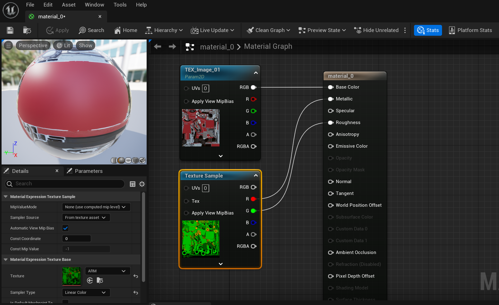
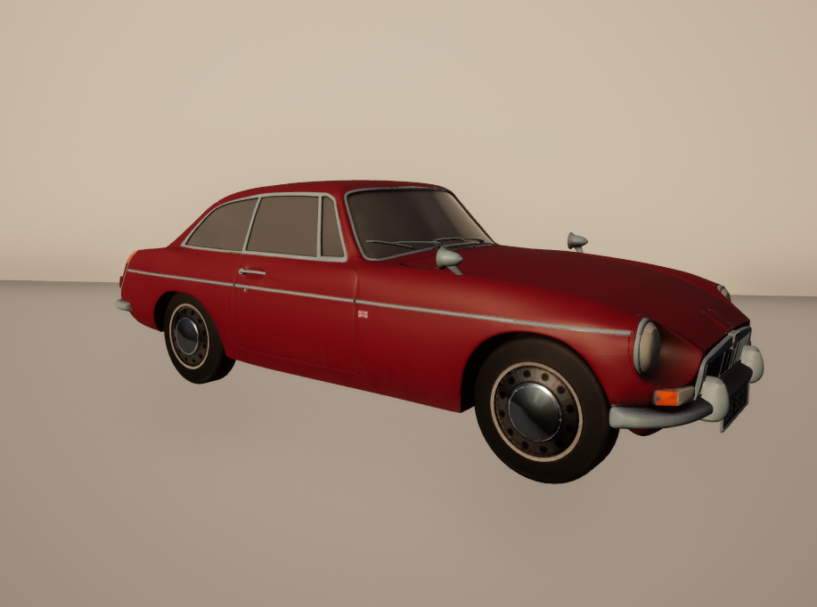

# MaterialSeg3D: Segmenting Dense Materials from 2D Priors for 3D Assets <a href="https://arxiv.org/abs/2404.13923"></a>


This is the official codebase for **MaterialSeg3D**, a novel apporach for generating surface PBR material information for 3D assets through 2D prior knowledge.
<br><br>
Motivated by the fact that expert 3D modelers tend to manually apply surface PBR material information based on their prior knowledge of the material information, we manage to utilize 2D perception-based method to learn material information from existing 2D images from public websites and datasets. We conduct a single-object material segmentation dataset **Materialized Individual Objects (MIO)**, and propose a novel workflow that can automatically predict the surface material information of the given 3D assets, named **MaterialSeg3D**.

## Getting Started

### Installation
- Download **MaterialSeg3D**
```sh
git clone https://github.com/PROPHETE-pro/MaterialSeg3D.git
cd MaterialSeg3D
conda create -n MaterialSeg3D python==3.9.15
conda activate MaterialSeg3D
```
- Install [Text2Tex](https://github.com/daveredrum/Text2Tex) dependencies
```sh
conda install pytorch==1.12.1 torchvision==0.13.1 torchaudio==0.12.1 cudatoolkit=11.3 -c pytorch
conda install -c fvcore -c iopath -c conda-forge fvcore iopath
conda install -c bottler nvidiacub
conda install pytorch3d -c pytorch3d
conda install xformers -c xformers
cd Text2Tex
pip install -r requirements.txt
cd ..
```
It is necessary to download `control_sd15_depth.pth` from the [hugging face page](https://huggingface.co/lllyasviel/ControlNet/tree/main/models), and put it under `./Text2Tex/models/ControlNet/models/`.
- Install [GET3D](https://github.com/nv-tlabs/GET3D/blob/master/install_get3d.sh) dependencies
```sh
pip install ninja xatlas gdown
pip install git+https://github.com/NVlabs/nvdiffrast/
pip install meshzoo ipdb imageio gputil h5py point-cloud-utils imageio imageio-ffmpeg==0.4.4 pyspng==0.1.0
pip install urllib3
pip install scipy
pip install click
pip install tqdm
pip install opencv-python==4.5.4.58
```
- Build Blender environment
```sh
# cd MaterialSeg3D
wget https://ftp.halifax.rwth-aachen.de/blender/release/Blender2.90/blender-2.90.0-linux64.tar.xz
tar -xvf blender-2.90.0-linux64.tar.xz
cd blender-2.90.0-linux64/2.90/python/bin
./python3.7m -m ensurepip
./python3.7m -m pip install numpy 
```
- Install [MMSegmentation](https://github.com/open-mmlab/mmsegmentation/blob/main/docs/en/get_started.md#installation)
```sh
pip install -U openmim
mim install mmengine
mim install "mmcv==2.1.0"

cd mmsegmentation
pip install -v -e .
```
- Download segmentation model weights from [GoogleDrive](https://drive.google.com/file/d/1R323ODbLvg1jjJ6cXoE364ZGyzFeZ_w0/view?usp=sharing), unzip and rename to `./work_dir` and place it under `MaterialSeg3D/mmsegmentation/`.

### Environment
- Our method is tested on A30 & A100. The provided version for important packages is based on our server status, if there are errors occur in the installation process, please refer to the version below. 
- Python == 3.9.15
- Pytorch == 1.12.1
- mmcv == 2.1.0
- mmengine == 0.10.3
- mmseg == 1.2.2
- Our workflow requires the environment to be compatible on [GET3D](https://github.com/nv-tlabs/GET3D), [Text2Tex](https://github.com/daveredrum/Text2Tex), [MMSegmentation](https://github.com/open-mmlab/mmsegmentation/tree/main).


### Inference Demo
```sh
cd MaterialSeg3D
python gradio_demo.py
```
- First remember to update the directory of your own path. The files need to be modified include `gradio_demo.py`, `./GET3D/render_shapenet_data/render_shapenet.py`,`./Text2Tex/scripts/view_2_UV.py`
- Please provide the directory of your 3D asset folder `./example/path_to_obj_file/`. Note that the folder should only contain one **.obj** mesh file and a Albedo RGB UV **.png** file, and an **.mtl** file. The folder name should match the name of the .obj file (i.e. `./example/car/car.obj`) 
- Select the category of your asset. We currently support `car, furniture, building, instrument, plant` for prediction.
- The stage output files can be found in `/output`, and the final generated ORM UV and materialized asset can be found in the object folder.
- The display quality of gr.Model3D is not satisfying enough, so we highly recommend you to render the asset in UE5 or Blender with the generated ORM UV map.
<figure class="half">
    
    
</figure>


## Citation
```BibTeX
@article{li2024materialseg3d,
  title={MaterialSeg3D: Segmenting Dense Materials from 2D Priors for 3D Assets},
  author={Li, Zeyu and Gan, Ruitong and Luo, Chuanchen and Wang, Yuxi and Liu, Jiaheng and Zhang, Ziwei Zhu Man and Li, Qing and Yin, Xucheng and Zhang, Zhaoxiang and Peng, Junran},
  journal={arXiv preprint arXiv:2404.13923},
  year={2024}
}
```
